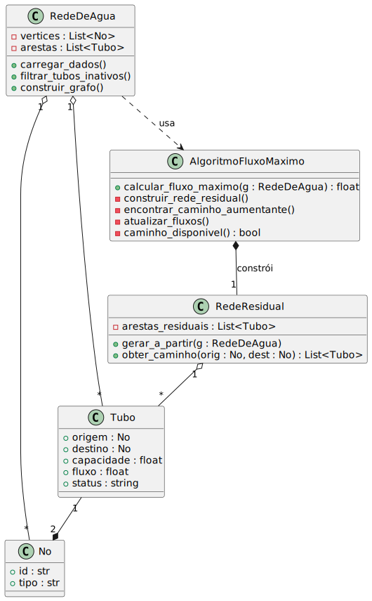
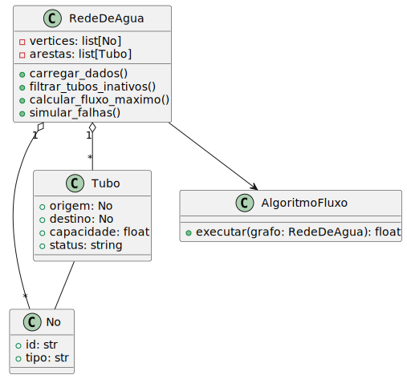
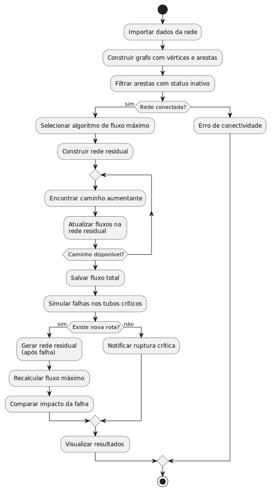

# Trabalho Prático de grafos
 

## 📌 Descrição do Problema – Monitoramento de Distribuição de Água com Grafos

Em centros urbanos e regiões agrícolas, a distribuição de água potável depende de uma vasta rede de tubulações, estações de bombeamento, válvulas e sensores. Essas infraestruturas são complexas, dinâmicas e vulneráveis a falhas operacionais como vazamentos, rompimentos e sobrecargas.

Com o avanço da urbanização e o aumento da demanda por água, garantir o fornecimento contínuo, seguro e eficiente tornou-se um desafio crítico. A complexidade cresce ainda mais quando se trata de monitorar e diagnosticar problemas em tempo real, especialmente em redes compostas por milhares de conexões distribuídas por grandes áreas.

Nesse contexto, a ausência de ferramentas inteligentes para simulação, detecção de falhas e reroteamento do fluxo pode resultar em desperdícios, interrupções no abastecimento e aumento de custos operacionais.

Portanto, torna-se essencial o desenvolvimento de uma solução capaz de representar computacionalmente a rede de distribuição de água, permitindo a identificação de pontos críticos, a simulação de falhas e a definição de rotas alternativas, com foco na confiabilidade e eficiência do sistema.

## 📌 Descrição da Modelagem – Otimização de Fluxo de Água com Grafos

O objetivo deste projeto é **modelar uma solução computacional que maximize o fluxo de água entre os pontos de origem e destino da rede**, considerando a infraestrutura atual e suas limitações operacionais.

A modelagem será feita com **estruturas de grafos direcionados e ponderados**, onde:

- **Vértices** representam pontos relevantes da rede, como estações de bombeamento, válvulas, ramificações e pontos de consumo.
- **Arestas** representam tubulações, com pesos correspondentes à **capacidade de vazão** e atributos adicionais como estado operacional, extensão e condição de uso.

### Etapas da modelagem:

#### 1. Filtragem de dados operacionais
Antes da aplicação do algoritmo de fluxo, será realizada uma filtragem nas arestas do grafo para **remover trechos atualmente inutilizáveis** (por falhas, manutenções ou rupturas). Isso reduz o tamanho da base e evita a simulação de rotas inviáveis.

#### 2. Cálculo do fluxo máximo
Após a filtragem, aplicaremos um **algoritmo de fluxo máximo** para identificar a capacidade máxima de abastecimento da rede entre os nós de origem (estações) e destino (regiões consumidoras).

**Algoritmos candidatos:**
- **Edmonds-Karp** (implementação do Ford-Fulkerson com BFS; boa legibilidade e desempenho razoável)
- **Dinic's Algorithm** (mais eficiente para grafos grandes e com múltiplos caminhos)

### 🔗 Diagrama de Caso de Uso

### 🔗 Diagrama de Classes

### 🔗 Diagrama de Atividades

#### 3. Análise de falhas e resiliência
Após obter o fluxo máximo inicial, simularemos **falhas em pontos críticos da rede** (remoção de arestas com maior fluxo ou centralidade) e analisaremos:

- Como essas falhas impactam o fluxo total.
- Se existe **um novo fluxo máximo alternativo** após a falha.
- Se há **formas de redistribuir o fluxo para mitigar os efeitos das falhas**.

**Ferramentas e algoritmos auxiliares:**
- **Centralidade de intermediação (Betweenness Centrality)** para identificar os canos mais críticos.
- **Análise de componentes conectados** para detectar desconexões.
- Reaplicação do algoritmo de fluxo máximo com grafos parcialmente danificados.

A implementação será feita em **Python**, com as seguintes bibliotecas:
- `NetworkX` para construção e manipulação dos grafos.
- `Pandas` para tratamento dos dados da rede.
- `Matplotlib` ou `Plotly` para visualizações interativas.

## 📑 Plano de Desenvolvimento

| Fase | Objetivo | Ações Principais | Diagramas Relacionados |
|------|----------|------------------|------------------------|
| **1. Coleta & Pré-processamento** | Obter e limpar os dados da rede | `carregar_dados()`, `filtrar_tubos_inativos()` | Use Case UC2 & UC3 |
| **2. Construção do Grafo** | Criar a `RedeDeAgua` com `No` e `Tubo` | `construir_grafo()`, verificação “Rede conectada?” | Diagrama de Classes |
| **3. Seleção do Algoritmo** | Permitir escolher Edmonds-Karp ou Dinic | UI/CLI → UC1 (“Escolher Algoritmo”) | Use Case UC1 |
| **4. Cálculo do Fluxo Máximo** | Gerar `RedeResidual` e calcular fluxo | `calcular_fluxo_maximo()`, loop de caminhos aumentantes | Activity Diagram |
| **5. Simulação de Falhas** | Avaliar resiliência da rede | `simular_falhas()`, recalcular fluxo, comparar impacto | Use Case UC4, UC6, UC7 |
| **6. Visualização & Relatório** | Exibir resultados de forma interativa | `Matplotlib/Plotly` para rede original e residual | UC7 (“Visualizar Resultados”) |
| **7. Entrega Final** | Documentar e publicar | README, diagramas PlantUML, dataset de exemplo | Todos |

### Ferramentas / Bibliotecas
- **Python 3.12**, `networkx`, `pandas`, `numpy`
- Visualização: `matplotlib` ou `plotly`
- Testes: `pytest`
- Diagramas: PlantUML
